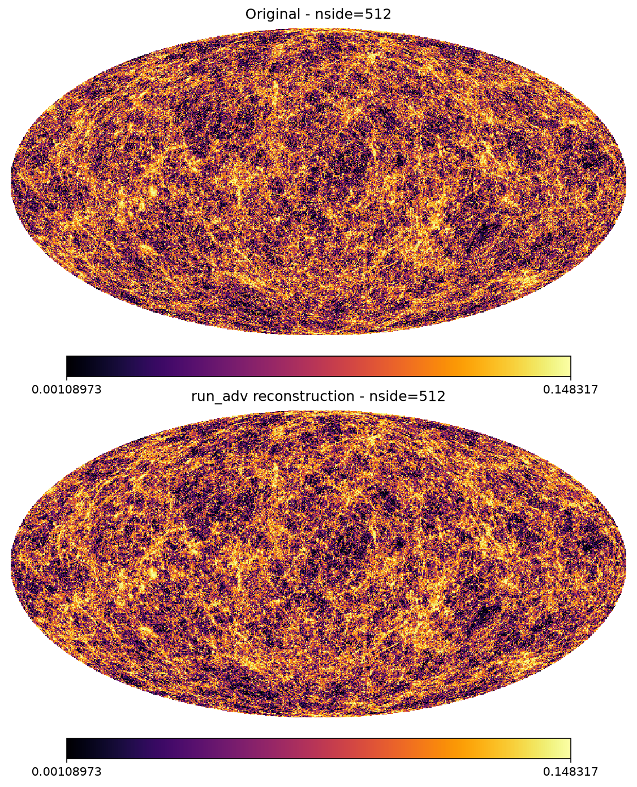
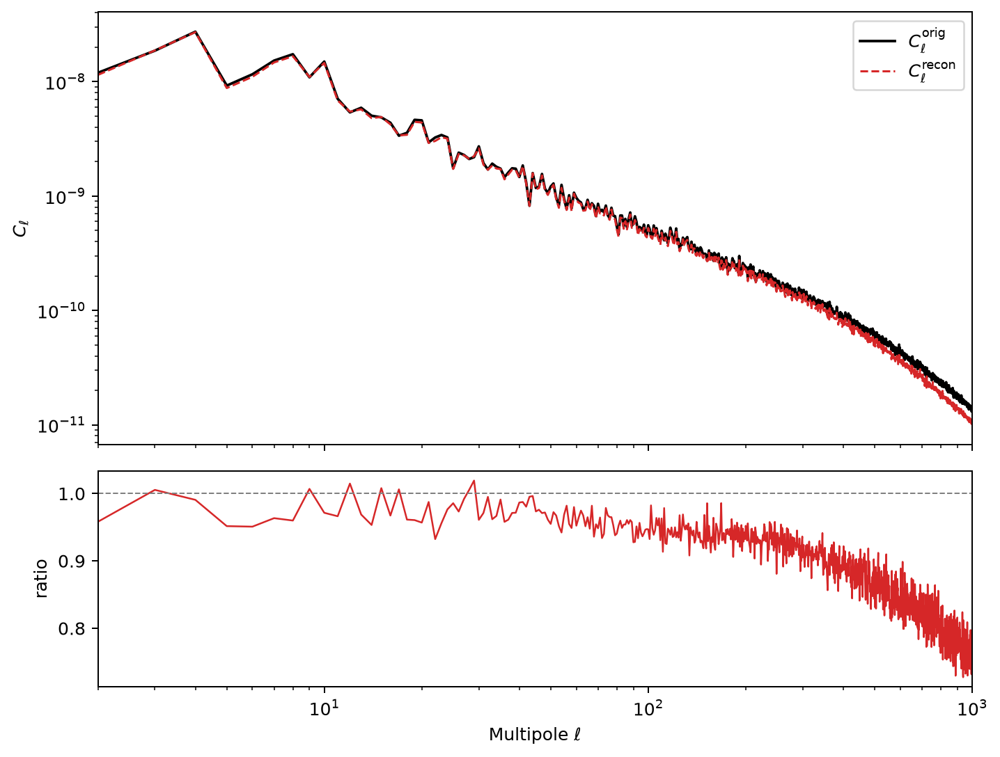
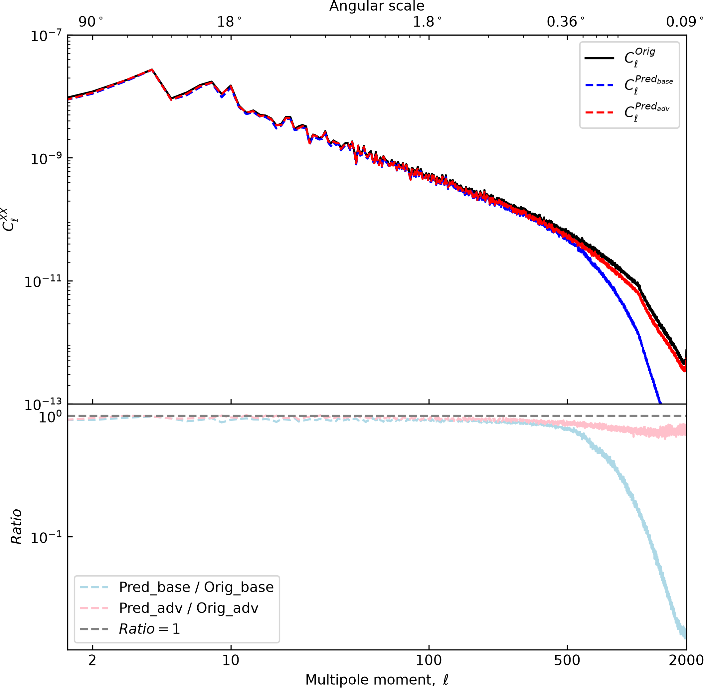
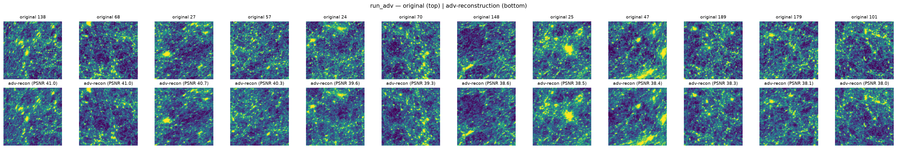

# CosmoTok

An adversarial FSQ (Finite Scalar Quantizer) autoencoder for **CosmoGrid** cosmological maps. Each 128×128 input patch is encoded to a discrete latent code and decoded back to a reconstructed field. A full CosmoGrid field contains **192 patches**, which tile a **nside = 512 HEALPix sky map** (12 × 512² = 3,145,728 pixels).

Two model variants are provided:

| Checkpoint | Description | Size |
|---|---|---|
| `weights/best_cosmogrid_base.ckpt` | FSQ autoencoder (no discriminator) | 1.9 GB |
| `weights/best_cosmogrid_adv.ckpt` | Adversarial FSQ autoencoder | 2.0 GB |

---

## 1. Environment

Use the `cosmogrid` conda environment (Python 3.12). **Do not** use the `base` env (Python 3.11) — it lacks the required dependencies.

```bash
conda activate cosmogrid
pip install -r requirements.txt
```

> `aion/` is a **local source package** (not the `polymathic-aion` PyPI package). Keep the repo root on `PYTHONPATH` — the scripts below do this automatically.

CUDA note: `torch==2.9.1` is pinned to the cu128 build (node driver 570.x). Do not upgrade torch without also upgrading the driver (see `requirements.txt`).

---

## 2. Download data & weights

The checkpoints and dataset field images are too large for GitHub — download them from Google Drive and place them at the paths shown:

| File | Destination on disk |
|---|---|
| [weights → Google Drive](https://drive.google.com/drive/folders/1KlBOyAxkIlLz1o7xO5CvJlYnyypQ8006?usp=sharing) | `weights/best_cosmogrid_adv.ckpt`, `weights/best_cosmogrid_base.ckpt` |
| [data → Google Drive](https://drive.google.com/drive/folders/1bovfVOgewyQq7K2NlM2yV7fP0QCKHBIP?usp=sharing) | `data/cosmogrid_data/content/` (100 `baryonified512_*.npy`) |

The small index files (`index.json`, `train/valid/test-index.json`, `stats.pkl`, 25 MB `arr_nside512_192x128x128.npy`) are already in the repo — no further setup needed.

---

## 3. Inference

One command: 192 patches → full sky map → Cℓ → plots.

```bash
python inference.py --ckpt weights/best_cosmogrid_adv.ckpt \
  --data-root data/cosmogrid_data \
  --content-file data/cosmogrid_data/content/baryonified512_036.npy \
  --out-dir assets --save-maps --save-cl --save-patches
```

The patch→HEALPix permutation is derived automatically from `data/cosmogrid_data/arr_nside512_192x128x128.npy` (no extra download). Pass `--rearr <file>` only if you have a precomputed `rearr_nside512.npy`.

---

## 4. Full-sky map (healpy)

Draw the composed nside=512 sky map (original top / reconstruction bottom), histogram-equalized:

```bash
python plot_skymap.py \
  --ckpt weights/best_cosmogrid_adv.ckpt \
  --content-file data/cosmogrid_data/content/baryonified512_036.npy \
  --out-png assets/sky_mollview.png
```

---

## 5. Analysis

The scripts in `analysis/` reconstruct fields and compare the base vs. adversarial models.

```bash
# 1. Reconstruct all 192 patches → origs.npy / preds.npy
python analysis/plot_cl.py --ckpt weights/best_cosmogrid_base.ckpt --output-dir results
mv results/origs.npy results/orig_base.npy
mv results/preds.npy results/pred_base.npy

python analysis/plot_cl.py --ckpt weights/best_cosmogrid_adv.ckpt --output-dir results
mv results/origs.npy results/orig_adv.npy
mv results/preds.npy results/pred_adv.npy

# 2. TT power spectrum comparison (orig vs recon)
python analysis/plot_cl_hp2.py --results-dir results --output TT_cl_comparison_diff.png

# 3. Power spectrum ratio (base vs adv)
python analysis/plot_cls.py --results-dir results --output cls_ratio.png

# 4. Best-PSNR patch + side-by-side comparison
python analysis/plot.py --split test --prefer-adv

# 5. Three-way patch dashboard (orig | base | adv)
python analysis/plot_patch.py --results-dir results --sample-index 100 --output comparison_dashboard.png
```

---

## 6. Training

```bash
# Adversarial model (default GPUs 0-3)
CUDA_VISIBLE_DEVICES=0,1,2,3 bash run_adv.sh

# Base (non-adversarial) model
CUDA_VISIBLE_DEVICES=0,1,2,3 bash run_base.sh
```

Both scripts auto-select the active conda env's Python and run a dependency sanity check before launching. See `src/imgtok/cfg-cosmo-adv.yaml` / `cfg-cosmo.yaml` for all settings.

---

## 7. Results

Full-sky map (original vs reconstruction, histogram equalized):



TT angular power spectrum `Cℓ` (original vs reconstruction):



Power spectrum ratio `Pred/Orig` (base vs adv):



Sample patches (original top | adv-reconstruction):



The reconstruction preserves small-scale structure and the power spectrum down to arc-minute scales (ℓ ≈ 1000).

---

## 8. Repository layout

```
src/            model & data code (imgtok, astro_utils, imgemb)
aion/           'aion' codec library (aion.codecs.*) — local source dependency
analysis/       analysis scripts (plot_cl, plot_cls, plot_cl_hp2, plot_patch, plot_skymap …)
data/cosmogrid_data/   indexes + stats (committed); content/*.npy (Google Drive)
weights/        checkpoints (Google Drive, not in git)
assets/         generated figures
inference.py    end-to-end inference: patches → sky map → Cℓ → plots
plot_skymap.py  healpy full-sky map (mollview)
plot_patch.py   patch comparison (original | adv-reconstruction)
run_adv.sh      training launcher (adversarial)
run_base.sh     training launcher (base)
```
